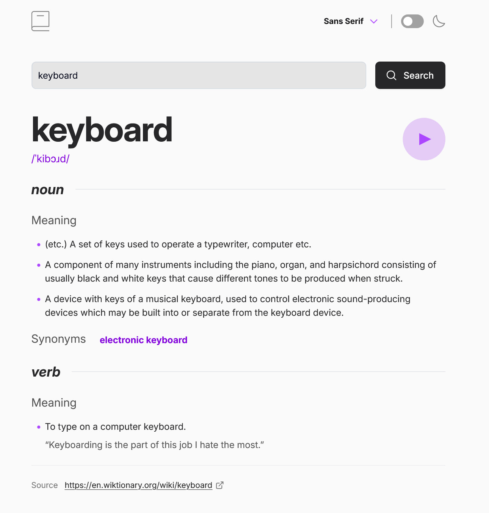
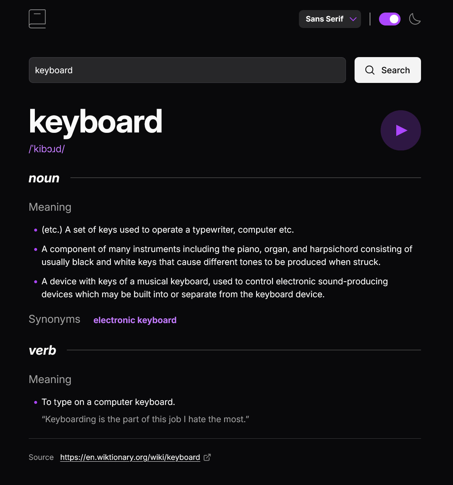

# Frontend Mentor - Dictionary web app solution

This is a solution to the [Dictionary web app challenge on Frontend Mentor](https://www.frontendmentor.io/challenges/dictionary-web-app-h5wwnyuKFL). Search any word to see its phonetic transcription, part-of-speech breakdowns, definitions, usage examples, synonyms, and antonyms — with a playable audio pronunciation when available.

## Table of contents

- [Overview](#overview)
  - [Live features](#live-features)
  - [Tech stack](#tech-stack)
  - [Screenshot](#screenshot)
  - [Links](#links)
  - [Project structure](#project-structure)
- [Architecture notes](#architecture-notes)
- [API reference](#api-reference)
- [Getting started](#getting-started)
- [Useful resources](#useful-resources)
- [Author](#author)
- [Acknowledgments](#acknowledgments)


## Overview

### Live Features

- Word search via the [Free Dictionary API](https://dictionaryapi.dev/)
- Playable audio pronunciation (when available)
- Clickable synonyms and antonyms that trigger a new search
- Manual light / dark theme toggle, persisted to `localStorage`
- Font switcher: Sans Serif (Inter), Serif (Lora), Monospace (Inconsolata)
- Fully responsive layout
- See hover and focus states for all interactive elements on the page
- Accessible design with semantic HTML
- Graceful error handling using the API's own error responses

### Tech Stack
 
| Layer | Tech or Tool |
|---|---|
| UI Library | React 19 |
| Build Tool | Vite |
| Styling | Tailwind CSS v4 |
| Fonts | Google Fonts (Inter, Lora, Inconsolata) |
| Data | Free Dictionary API (REST, no auth) |

### Screenshot





### Links

- [Solution URL](https://your-solution-url.com)
- [live demo site](https://your-live-site-url.com)

### Project Structure
 
```
src/
├── components/
│   ├── Header.jsx        # Logo, font switcher, theme toggle
│   ├── SearchForm.jsx    # Controlled form input with inline validation
│   ├── WordResult.jsx    # Result container — composes Phonetic + Definitions
│   ├── WordHeader.jsx    # Word heading, phonetic text, audio button
│   ├── Definitions.jsx   # Meanings, definitions, examples, synonyms/antonyms
│   └── NotFound.jsx      # 404 / error state display
├── context/
│   └── ThemeContext.jsx  # Global theme + font state
├── hooks/
│   └── useDictionary.js  # API fetching, normalization, status management
├── App.jsx
├── main.jsx
└── index.css
```


## Architecture Notes

### Data Layer: `useDictionary` Hook

The custom hook handles all API interaction, exposing a consistent interface to the web app. 

```js
const { result, status, error, search, reset } = useDictionary()
```

For the `status` state options, I went with specific strings (`'idle' | 'loading' | 'success' | 'error'`) instead of multiple boolean values for an easier-to-understand and simpler to maintain rendering logic.

The hook also handles normalizing the data retrieved from the API before storing it, limiting the impact of potentially inconsistently shaped records. The two helper functions `extractPhonetic` and `normalizeEntry` run before state is set, so each component receives predictable data.

`search` is wrapped in `useCallback` to keep its reference stable across renders, since it is passed as a prop to `SearchBar` and might cause unnecessary re-renders.

### Theme System: Class-based Dark Mode

The theme system leverages React context and Tailwind's `dark` class variant features. 

```css
@custom-variant dark (&:where(.dark, .dark *));
```

Additionally, preferences are persisted using `localStorage` and re-applied on mount.

```js
export function ThemeProvider({ children }) {
  const [darkMode, setDarkMode] = useState(() => {
    const stored = localStorage.getItem("theme");
    if (stored) return stored === "dark";
    return window.matchMedia("(prefers-color-scheme: dark)").matches;
  });
  ...
```

### Font Switching

The three font families called for by the project's design requirements are registered as Tailwind theme variables in `index.css` via the `@theme` block:
 
```css
@theme {
  --font-sans:  'Inter', sans-serif;
  --font-serif: 'Lora', serif;
  --font-mono:  'Inconsolata', monospace;
}
```
 
```js
const [font, setFont] = useState("sans"); // sans, serif, mono
...
const changeFont = (font) => {
    setFont(font);
    localStorage.setItem("dict-font", font);
  };
```

The React context `ThemeContext` is also used here to store the active font and apply the utility class (`font-sans`, `font-serif`, or `font-mono`) on the root `<div>` in `App.jsx`. 

### Audio Playback
 
Pronunciation audio (when available) is handled with a standard HTML `<audio>` along with the `useRef` hook. The play button's visual styling is handled by responding to the `onPlay` and `onEnded` events.
 
Since audio availability for a particular word is not guaranteed by the API, the `extractPhonetic` helper function searches the `phonetics` array received from the API for an entry that has a non-empty `audio` property. The play button is then conditionally rendered using the `audioUrl` prop.

### Synonym / Antonym Navigation
 
If the search word result contains synonyms and/or antonyms, they're rendered as `<button>` "tag" elements, using the `WordTagList` helper function. The implied functionality from the design comp is that selecting a word in these lists will execute a new search. To that end, the `onClick` property on these buttons calls `search` directly with the word as the argument, triggering a fresh dictionary lookup without the need for additional handler logic.


### Accessibility Concerns

The app is fully navigable with keyboard-only commands, and proper semantic HTML is utilized throughout. While my execution of the web app largely reflects the design comp, I did utilize the most closely matched Tailwind colors rather than add the collection of custom colors from the design. I gauged the design was straightforward enough to achieve a good match without having to stray from the Tailwind colors, though I did make some adjustments based on minimum contrast values to achieve better accessibility. 

Where the design comp calls for an independent search field and no clear button element, I decided to include a proper "Search" button within my form. The change is visually minor, but I feel it improves the overall accessibility and usability of the app.


## API Reference
 
**Endpoint:** `GET https://api.dictionaryapi.dev/api/v2/entries/en/{word}`
 
**Success response:** An array of entry objects. The app uses `data[0]`.
 
**Key fields used:**
 
| Field | Notes |
|---|---|
| `word` | The searched term |
| `phonetics[].text` | Phonetic transcription |
| `phonetics[].audio` | Audio file URL (not always present) |
| `meanings[].partOfSpeech` | e.g. `"noun"`, `"verb"` |
| `meanings[].definitions[].definition` | Definition string |
| `meanings[].definitions[].example` | Usage example (optional) |
| `meanings[].synonyms` | Array of synonym strings |
| `meanings[].antonyms` | Array of antonym strings |
| `sourceUrls` | Attribution link(s) to Wiktionary |
 
**Error response (404):**
 
```json
{
  "title": "No Definitions Found",
  "message": "Sorry pal, we couldn't find definitions for the word you were looking for.",
  "resolution": "You can try the search again at later time or head to the web instead."
}
```
 
---
 
## Getting Started
 
```bash
# Install dependencies
npm install
 
# Start development server
npm run dev
 
# Build for production
npm run build
```
 
---
 
## Useful resources

- [The Joy of React](https://courses.joshwcomeau.com/) - In building out the form markup and behavior, I hewed quite close to the fundamental content Josh Comeau presents in his excellent Joy of React course. I can't recommend Josh's teachings enough.
- [The A11Y Style Guide](https://a11y-style-guide.com/) - The A11Y Style Guide is an excellent resource for building out thoughtful, accessible elements and behaviors.


## Author

- Website - [Matt Pahuta](https://www.mattpahuta.com)
- Frontend Mentor - [@mattpahuta](https://www.frontendmentor.io/profile/MattPahuta)
- Bluesky - [@mattpahuta](https://bsky.app/profile/mattpahuta.bsky.social)
- LinkedIn - [Matt Pahuta](www.linkedin.com/in/mattpahuta)


## Acknowledgements
 
- Challenge design by [Frontend Mentor](https://www.frontendmentor.io/)
- Dictionary data by the [Free Dictionary API](https://dictionaryapi.dev/)
- Typefaces: [Inter](https://fonts.google.com/specimen/Inter), [Lora](https://fonts.google.com/specimen/Lora), [Inconsolata](https://fonts.google.com/specimen/Inconsolata) via Google Fonts